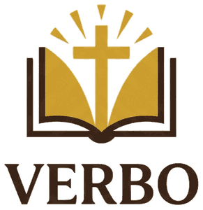

<p align="center">
  
</p>

# Verbo

RAG fechado sobre a Biblia Catolica Ave Maria, em portugues. Responde perguntas usando so o texto da Biblia como fonte, sem inventar com conhecimento geral do LLM.

## Stack

- Python
- ChromaDB (banco vetorial local)
- NVIDIA NIM (embeddings + chat completions, free tier)
- Streamlit (interface)

## Estrutura

```
verbo/
    data/
        biblia-ave-maria.json    fonte (73 livros, 35.450 versiculos)
        construir-banco.py       gera embeddings e popula o Chroma (chunking por capitulo)
    chroma-db/                   banco vetorial pre-construido (versionado)
    modules/
        busca.py                 consulta o Chroma, retorna trechos proximos
        resposta.py              monta prompt e chama NVIDIA NIM chat completions
    assets/                      logo e favicon
    app.py                       interface Streamlit
    config.py                    configuracoes, nomes de modelo, paths
    teste-conexao.py             script de diagnostico da API NVIDIA NIM
```

O chunking agrupa os versiculos por capitulo (quebrando em pedacos de ate 1500
caracteres quando o capitulo e muito longo), em vez de indexar cada versiculo
isolado. Isso da mais contexto pra busca semantica e mantem o indice pequeno
o bastante para versionar no git (~13MB). Estrategia inspirada no projeto
[biblos](https://github.com/dssjon/biblos).

## Como rodar localmente

```bash
python -m venv .venv
.venv\Scripts\activate          # Windows
pip install -r requirements.txt
```

Copie `.env.example` para `.env` e preencha a `NVIDIA_API_KEY` (gratis em https://build.nvidia.com).

O `chroma-db/` ja vem pronto no repositorio. So reconstrua se mudar a fonte,
o modelo de embedding ou a estrategia de chunking:

```bash
python data/construir-banco.py
```

Rode o app:

```bash
streamlit run app.py
```
